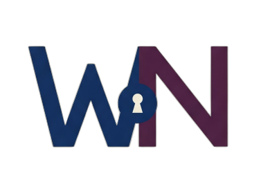
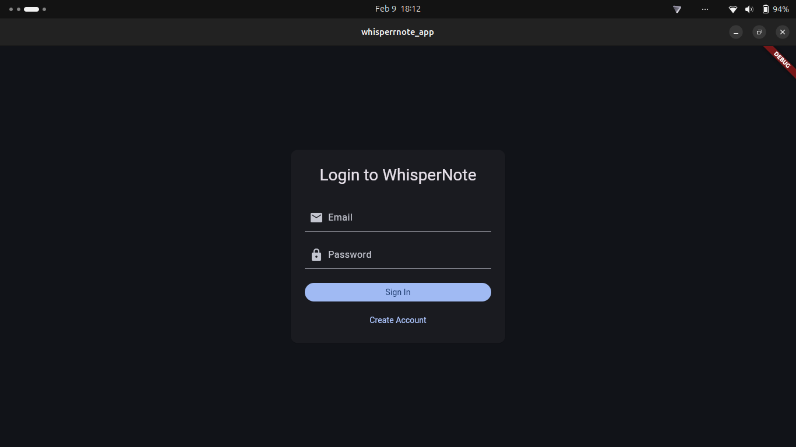
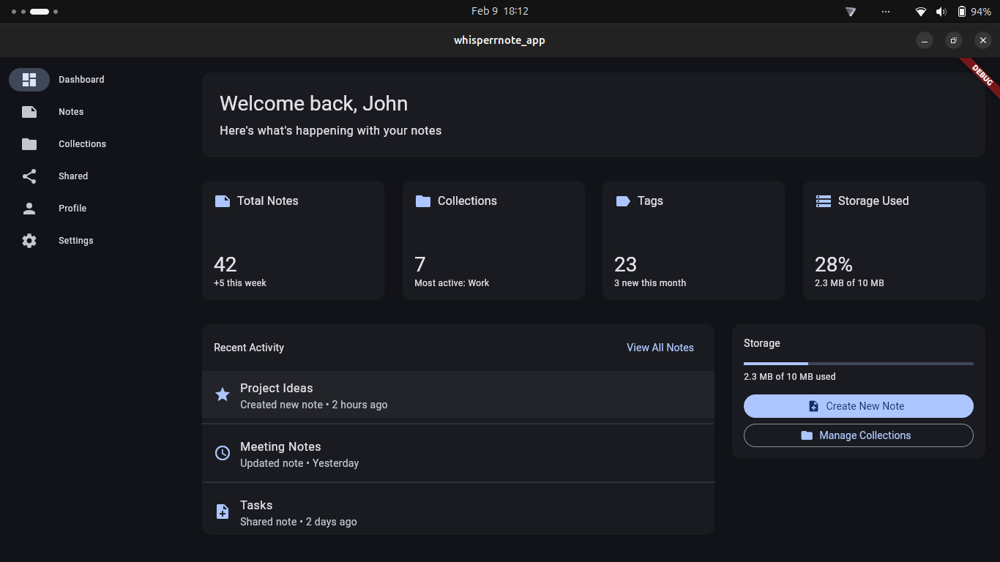
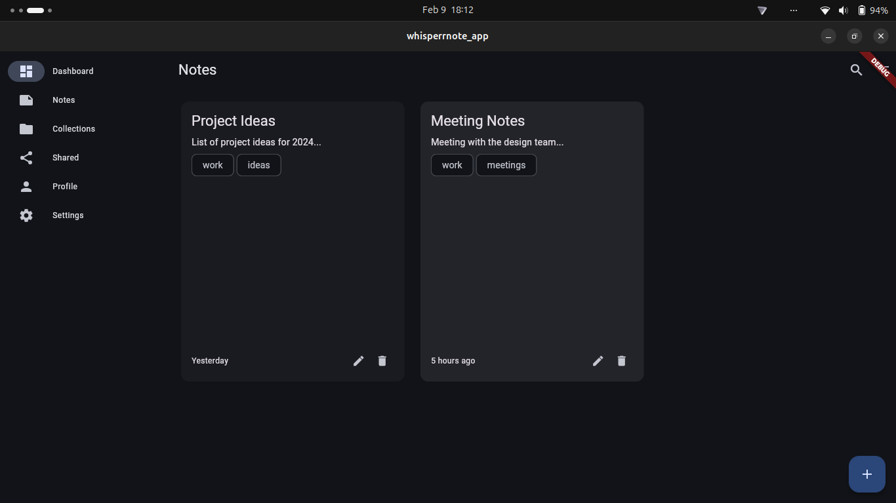
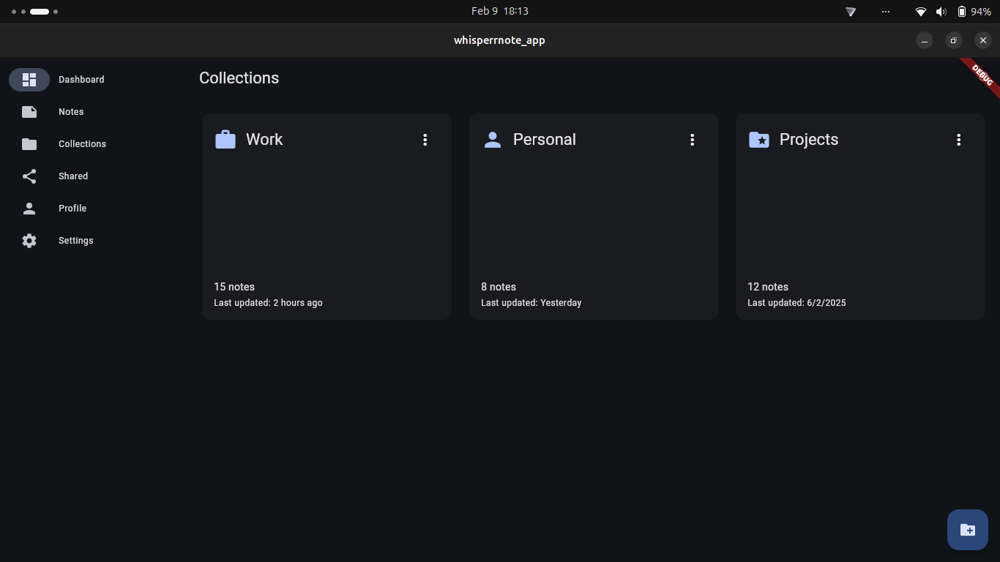
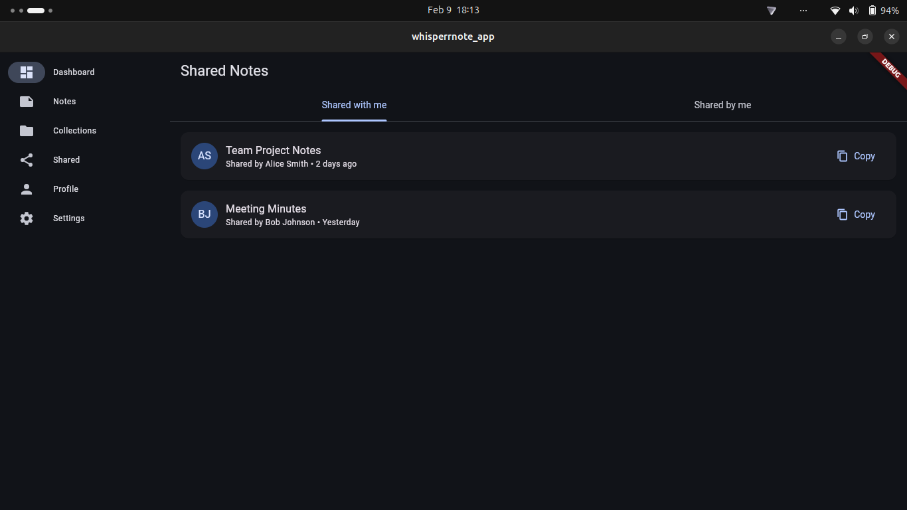
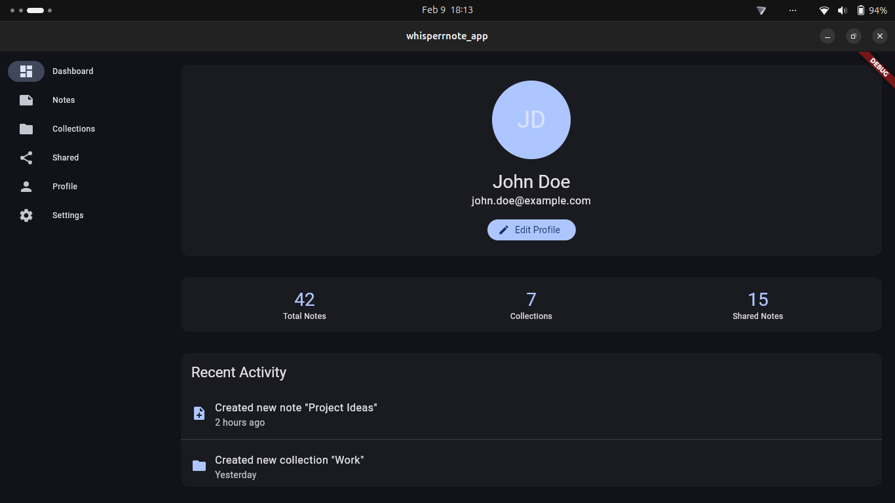

# 🤫 WhisperNote: Your Secure, Cross-Platform Note-Taking Oasis 🚀



Welcome to WhisperNote, the ultimate note-taking application designed with **your privacy, accessibility and productivity** in mind! 📝✨ Whether you're jotting down brilliant ideas, organizing your thoughts, or keeping track of important information, WhisperNote provides a seamless and secure experience across all your devices.

## 🧩 Integrations

WhisperNote supports modular integrations to extend functionality with decentralized protocols and networks.

- **Umi Integration:** Enables interaction with Umi smart contracts for decentralized features.  
  _Codebase: `src/integrations/umi`_
- **Starknet Integration:** Adds Layer 2 scalability and decentralized storage.  
  _Codebase: `src/integrations/starknet`_
- **Calimero Integration:** Provides enhanced privacy and data protection.  
  _Codebase: `src/integrations/calimero`_
- **ICP SDK Integration:** Supports decentralized data storage and reliability.  
  _Codebase: `src/integrations/icp`_

## 🛡️ Unbreakable Security & Robustness

WhisperNote uses end-to-end encryption and decentralized technologies to keep your notes private and secure.

## 📱💻 Cross-Platform Freedom

Experience the freedom of accessing your notes anytime, anywhere, on virtually any device:

*   **Web:** Seamlessly access WhisperNote through your favorite web browser. 🌐
*   **Android & iOS:** Native mobile apps for on-the-go note-taking. 📱
*   **macOS, Linux, & Windows:** Dedicated desktop applications for a native experience. 🖥️
*   **CLI Client:** Power users can leverage the command-line interface for advanced note management. 💻
*   **Browser Extension:** Save content directly from your browser. 🧩

## ✨ Key Features

*   **Intuitive Interface:** A clean and user-friendly design for effortless note creation and organization. 🎨
*   **Rich Text Editing:** Format your notes with headings, lists, and more. ✍️
*   **Offline Access:** Access your notes even without an internet connection. 📶
*   **Real-Time Sync:** Keep your notes synchronized across all your devices. 🔄
*   **Customizable Themes:** Personalize your note-taking experience with a variety of themes. 🌈

## 🚀 Getting Started

1.  **Download & Install:** Choose the appropriate client for your platform from our [website](https://whisperrnote.space). ⬇️
2.  **Create an Account:** Sign up for a free account to start securely storing your notes. ✍️
3.  **Start Notetaking:** Begin capturing your thoughts and ideas with WhisperNote! 💡

## 📥 Download & Build Instructions

The easiest way to get started is to use the web app at [whisperrnote.space](https://whisperrnote.space).

For other platforms, follow the instructions below:

### Web

1. **Navigate to the root directory:**
    ```sh
    cd /path/to/whisperrnote
    ```
2. **Install dependencies and start the development server:**
    ```sh
    pnpm install
    pnpm dev
    ```

### macOS, Windows, Linux

1. **Navigate to the apps directory:**
    ```sh
    cd /path/to/whisperrnote/apps
    ```
2. **Ensure Flutter is installed.**
3. **Run the necessary commands to build for your platform:**
    - **macOS:**
        ```sh
        flutter build macos
        ```
    - **Windows:**
        ```sh
        flutter build windows
        ```
    - **Linux:**
        ```sh
        flutter build linux
        ```

### Android & iOS

1. **Navigate to the apps directory:**
    ```sh
    cd /path/to/whisperrnote/apps
    ```
2. **Ensure Flutter is installed.**
3. **Run the necessary commands to build for your platform:**
    - **Android:**
        ```sh
        flutter build apk
        ```
    - **iOS:**
        ```sh
        flutter build ios
        ```

### Browser Extension

1. **Navigate to the extension directory:**
    ```sh
    cd /path/to/whisperrnote/extension
    ```
2. **Run the necessary commands to build the extension:**
    ```sh
    pnpm install
    pnpm build
    ```

### VSCode Extension

1. **Navigate to the framework directory:**
    ```sh
    cd /path/to/whisperrnote/framework
    ```
2. **Run the necessary commands to build the VSCode extension:**
    ```sh
    pnpm install
    pnpm build
    ```

Note: Some platforms are still under development.

## 🧪 Test Deployment

The following URLs are available during local development:

### Backend Canisters (Candid Interface)

- **Context Contract:** [http://127.0.0.1:4943/?canisterId=br5f7-7uaaa-aaaaa-qaaca-cai&id=bkyz2-fmaaa-aaaaa-qaaaq-cai](http://127.0.0.1:4943/?canisterId=br5f7-7uaaa-aaaaa-qaaca-cai&id=bkyz2-fmaaa-aaaaa-qaaaq-cai)
- **Ledger:** [http://127.0.0.1:4943/?canisterId=br5f7-7uaaa-aaaaa-qaaca-cai&id=bd3sg-teaaa-aaaaa-qaaba-cai](http://127.0.0.1:4943/?canisterId=br5f7-7uaaa-aaaaa-qaaca-cai&id=bd3sg-teaaa-aaaaa-qaaba-cai)
- **Mock External:** [http://127.0.0.1:4943/?canisterId=br5f7-7uaaa-aaaaa-qaaca-cai&id=be2us-64aaa-aaaaa-qaabq-cai](http://127.0.0.1:4943/?canisterId=br5f7-7uaaa-aaaaa-qaaca-cai&id=be2us-64aaa-aaaaa-qaabq-cai)

You can interact with these canisters through their Candid interfaces during local development and testing.

## 📸 Screenshots

Here are some screenshots showcasing the WhisperNote experience:








## 🤝 Contributing

We welcome contributions from the community! If you're interested in helping us improve WhisperNote, please check out our [contribution guidelines](https://whisperrnote.space/contributing). 🧑‍💻

## 📜 License

WhisperNote is licensed under the [MIT License](LICENSE).

## 🎉 Join the WhisperNote Community!

Stay up-to-date with the latest news and developments by following us on:

*   [Discord](https://discord.gg/YDcm6FzN) 💬

Thank you for choosing WhisperNote! We're confident that you'll love the peace of mind and productivity it brings to your note-taking experience. 😊


